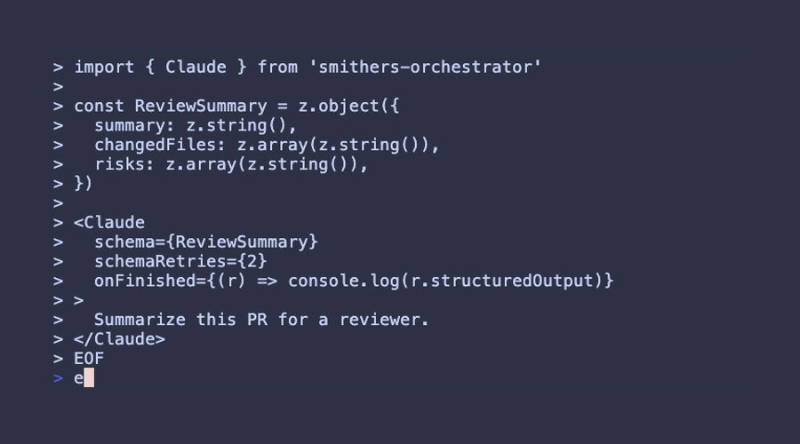
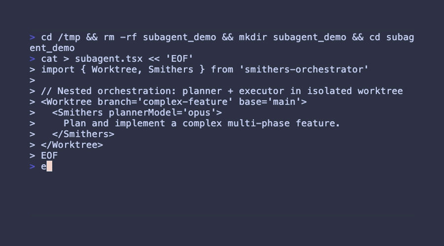
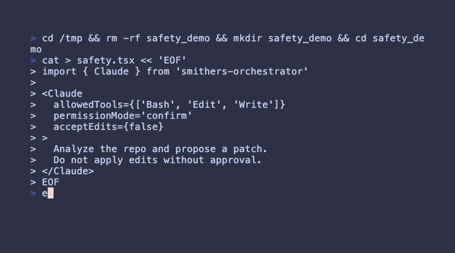

# Smithers

[](https://www.npmjs.com/package/smithers-orchestrator)
[](https://opensource.org/licenses/MIT)
[](https://www.typescriptlang.org/)
[](https://bun.sh/)

**Durable JSX workflows for Claude Code and coding agents.**

Run CI recovery, PR finalization, stacked merges, release smoketests, and review processing as **resumable, inspectable workflows**—not fragile scripts.

```
┌─────────────────────────────────────────────────────────────────────────────┐
│                         Smithers Workflow Engine                            │
├─────────────────────────────────────────────────────────────────────────────┤
│                                                                             │
│   JSX Orchestration  ──▶  Claude Agents  ──▶  SQLite State                 │
│                                                                             │
│   ┌─────────────┐        ┌─────────────┐      ┌─────────────┐              │
│   │   Phases    │───────▶│  Parallel   │─────▶│  Resumable  │              │
│   │   & Steps   │        │   Agents    │      │   History   │              │
│   └─────────────┘        └─────────────┘      └─────────────┘              │
│                                                                             │
│   Worktrees • CI Polling • PR Merging • Review Handling • Reports          │
└─────────────────────────────────────────────────────────────────────────────┘
```

- **Durability** - SQLite-backed state, resume after restarts, full audit trail
- **Structure** - Phases, steps, parallelism—not a pile of prompts
- **Repo-native** - Worktrees, commits, review gates, CI polling
- **Agent-native** - JSX readable by humans, generatable by Claude

---

## Table of Contents

- [Install](#install)
- [2-Minute Hello Workflow](#2-minute-hello-workflow)
- [Hero Workflows](#hero-workflows)
- [Why Smithers](#why-smithers)
- [Core Primitives](#core-primitives)
- [Features](#features)
- [Safety & Trust](#safety--trust)
- [Debugging & Observability](#debugging--observability)
- [Roadmap](#roadmap)
- [FAQ](#faq)
- [Contributing](#contributing)

---

## Install

### Option A: Claude Code Plugin (recommended)

Install the Smithers plugin so Claude can generate workflows directly:

```
/plugin add evmts/smithers
```

Then ask Claude:

```
"Create a workflow that monitors CI, fixes failures, and escalates after 3 attempts."
```


### Option B: npm package

```bash
bun add smithers-orchestrator
```

**Prerequisites:** [Bun](https://bun.sh/) v1.0+ and [Claude Code](https://www.npmjs.com/package/@anthropic-ai/claude-code)

### AI Agent Context

Give your coding agent full Smithers documentation:

| Resource | URL | Use Case |
|----------|-----|----------|
| LLMS.txt | https://smithers.sh/llms.txt | Paste into agent context |
| MCP Server | https://smithers.sh/mcp | Add as MCP server in Claude/Cursor |

---

## 2-Minute Hello Workflow

Create `hello.tsx`:

```tsx
#!/usr/bin/env bun
import {
  createSmithersRoot,
  createSmithersDB,
  SmithersProvider,
  Claude,
} from "smithers-orchestrator";

const db = createSmithersDB({ path: ".smithers/hello" });
const executionId = db.execution.start("Hello", "hello.tsx");

function Hello() {
  return (
    <SmithersProvider db={db} executionId={executionId} maxIterations={3}>
      <Claude model="haiku" maxTurns={1} onFinished={(r) => console.log(r.output)}>
        Say "Hello from Smithers!"
      </Claude>
    </SmithersProvider>
  );
}

const root = createSmithersRoot();
await root.mount(Hello);
await db.close();
```

Run:

```bash
bun hello.tsx
```


---

## Hero Workflows

### PR Finalize Autopilot

Get all your worktree PRs into a mergeable state and merged—parallel or sequential.

```bash
# Finalize all worktrees in parallel
bun examples/worktree-pr-finalize/index.tsx

# Finalize single worktree
bun examples/worktree-pr-finalize/index.tsx --worktree fix-auth-bug

# Sequential mode with merge commits
bun examples/worktree-pr-finalize/index.tsx --sequential --merge-method merge
```

**Phases:** StackCheck → Rebase → Review → Push → Poll CI → Merge

```
┌────────────────────────────────────────────────────────────────────────┐
│  PR Finalize Autopilot                                                 │
├────────────────────────────────────────────────────────────────────────┤
│                                                                        │
│  Worktree 1 ─┬─▶ [Stack?] ─▶ [Rebase] ─▶ [Review] ─▶ [Push] ─▶ [CI] ─▶ [Merge]
│              │                                                         │
│  Worktree 2 ─┤   (Parallel execution with coordination)               │
│              │                                                         │
│  Worktree N ─┘                                                         │
│                                                                        │
└────────────────────────────────────────────────────────────────────────┘
```

### Stacked PR Merge

Merge worktree PRs into clean linear history on main.

```bash
# Status only (safe, shows merge candidates)
bun examples/stacked-pr-merge/index.tsx --status

# Full merge with rebase
bun examples/stacked-pr-merge/index.tsx

# Skip rebase, cherry-pick directly
bun examples/stacked-pr-merge/index.tsx --skip-rebase
```

**Phases:** Status → Order (Claude validates) → Rebase Stack → Cherry-pick Merge

```
┌────────────────────────────────────────────────────────────────────────┐
│  Stacked PR Merge                                                      │
├────────────────────────────────────────────────────────────────────────┤
│                                                                        │
│  Worktrees ──▶ [Status] ──▶ [Order] ──▶ [Rebase] ──▶ [Cherry-pick]    │
│                               │                                        │
│                    Claude validates merge order                        │
│                                                                        │
└────────────────────────────────────────────────────────────────────────┘
```

### More Examples

| Workflow | Description | Command |
|----------|-------------|---------|
| Night Shift | Iterate until tests pass, commit each fix | `bun examples/night-shift/index.tsx` |
| Review Processor | Parallel processing of review backlogs | `bun examples/review-processor/index.tsx` |
| Task Audit | Audit task management across codebase | `bun examples/task-management-audit/index.tsx` |


---

## Why Smithers

### The Problem

Agent scripts don't survive contact with reality:
- **No state** - Can't resume after restart
- **No observability** - Hard to trust what happened
- **Poor concurrency** - Parallel chaos
- **Brittle sequencing** - Steps run out of order

### The Solution

Smithers uses React's component model to define execution plans as **reviewable code**.

- **You can read it** - JSX is familiar, composable, diffable
- **Claude can generate it** - Agent-native syntax
- **Git can version it** - Workflows are code, not prompts


---

## Core Primitives

| Primitive | Purpose |
|-----------|---------|
| `<SmithersProvider>` | Root orchestration loop (durable iteration) |
| `<Phase>` / `<Step>` | Structured execution stages |
| `<Parallel>` | Concurrent agents with coordination |
| `<Claude>` | Execute Claude via CLI with tool access + structured output |
| `<Worktree>` | Isolate repo changes per branch |
| SQLite DB | Flight recorder: state + history + resumable executions |


---

## Features

<details>
<summary><strong>Click to expand full feature list</strong></summary>

### Starter Workflows

### 1. Night Shift: Run Until Tests Pass

Goal: Keep iterating until all tests pass, with incremental commits.

```tsx
#!/usr/bin/env bun
import { createSmithersRoot, createSmithersDB, SmithersProvider, Claude } from "smithers-orchestrator";

const db = createSmithersDB({ path: ".smithers/night-shift" });
const executionId = db.execution.start("Night Shift", "night-shift.tsx");

function NightShift() {
  return (
    <SmithersProvider db={db} executionId={executionId} maxIterations={50}>
      <Claude
        model="sonnet"
        onFinished={(result) => {
          if (result.output.includes("All tests pass")) {
            db.state.set("complete", "true");
          }
        }}
      >
        Run tests. If any fail, fix them and commit the fix. Repeat until all tests pass.
      </Claude>
    </SmithersProvider>
  );
}

const root = createSmithersRoot();
await root.mount(NightShift);
await db.close();
```

```bash
bun night-shift.tsx
```

### 2. PRD to Implementation

Goal: Plan, implement, test, produce PR summary.

```tsx
#!/usr/bin/env bun
import { createSmithersRoot, createSmithersDB, SmithersProvider, Phase, Step, Claude } from "smithers-orchestrator";

const db = createSmithersDB({ path: ".smithers/prd-impl" });
const executionId = db.execution.start("PRD Implementation", "prd-impl.tsx");

function PRDToImplementation() {
  return (
    <SmithersProvider db={db} executionId={executionId} maxIterations={20}>
      <Phase name="Plan">
        <Step name="analyze-prd">
          <Claude model="sonnet">
            Read PRD.md. Create implementation plan with acceptance criteria.
          </Claude>
        </Step>
      </Phase>

      <Phase name="Implement">
        <Step name="write-code">
          <Claude model="sonnet">
            Implement the plan. Commit after each logical unit of work.
          </Claude>
        </Step>
        <Step name="write-tests">
          <Claude model="sonnet">
            Write tests for the implementation. Ensure all pass.
          </Claude>
        </Step>
      </Phase>

      <Phase name="Summary">
        <Step name="pr-summary">
          <Claude model="sonnet">
            Generate PR summary with what changed and why.
          </Claude>
        </Step>
      </Phase>
    </SmithersProvider>
  );
}

const root = createSmithersRoot();
await root.mount(PRDToImplementation);
await db.close();
```

### Structured Output with Zod

Get typed, validated responses:

```tsx
import { z } from "zod";

const UserSchema = z.object({
  name: z.string(),
  email: z.string().email(),
});

<Claude schema={UserSchema} schemaRetries={2}>
  Extract user info from: John Doe (john@example.com)
</Claude>
// result.structured: { name: string, email: string }
```



### MCP Tool Integration

Give Claude access to external tools via Model Context Protocol:

```tsx
<Claude>
  <Sqlite path="./data.db" readOnly>
    Database schema: users(id, name, email), orders(id, user_id, total)
  </Sqlite>
  Generate a report of top customers by order value.
</Claude>
```

### AI SDK Tool Format

Define tools with Zod schemas and pass them to Claude:

```tsx
import { z } from "zod";
import { createSmithersTool } from "smithers-orchestrator/tools";

const reportTool = createSmithersTool({
  name: "report",
  description: "Report progress to the orchestrator",
  inputSchema: z.object({
    message: z.string(),
    severity: z.enum(["info", "warning", "error"]).optional(),
  }),
  execute: async ({ message, severity }, { db }) => {
    await db.vcs.addReport({
      type: "progress",
      title: "Agent Report",
      content: message,
      severity: severity ?? "info",
    });
    return { success: true };
  },
});

<Claude tools={[reportTool]}>
  Report progress as you go.
</Claude>
```

### Smithers Subagent

Spawn a new Smithers instance to plan and execute complex subtasks:

```tsx
<Smithers
  plannerModel="opus" // Model for planning the script
  executionModel="sonnet" // Model for agents in the script
  timeout={600000} // 10 minute timeout
  keepScript // Save the generated script for debugging
>
  Create a new REST API endpoint with full CRUD operations, database migrations,
  and comprehensive test coverage.
</Smithers>
```



### Worktree

Run agents in isolated git worktrees:

```tsx
<Worktree branch="feature-auth" cleanup>
  <Claude>Implement user authentication</Claude>
</Worktree>
```

### Git/JJ VCS Integration

First-class version control support:

```tsx
// Git
<Commit message="feat: Add user auth" notes={{ smithers: true }} />

// Jujutsu (jj)
<Snapshot description="Before refactoring" />
<Commit autoDescribe />
```


### Orchestration Lifecycle

Global timeout and completion logic for workflows:

```tsx
<Orchestration
  globalTimeout={3600000} // 1 hour max
  onComplete={() => console.log("Workflow finished")}
  onTimeout={() => console.log("Workflow timed out")}
>
  {/* Your workflow components */}
</Orchestration>
```

### PhaseRegistry & Step

Manage multi-phase sequential execution:

```tsx
<PhaseRegistry>
  <Phase name="implement">
    <Step name="write-code" snapshotBefore commitAfter commitMessage="feat: Implementation">
      <Claude>Implement the feature</Claude>
    </Step>
    <Step name="write-tests">
      <Claude>Write tests for the implementation</Claude>
    </Step>
  </Phase>
  <Phase name="review">
    <Review target={{ type: "diff", ref: "main" }} />
  </Phase>
</PhaseRegistry>
```

### Parallel Execution

Run multiple agents concurrently within a step:

```tsx
<Parallel>
  <Claude model="haiku">Quick task 1</Claude>
  <Claude model="haiku">Quick task 2</Claude>
  <Claude model="haiku">Quick task 3</Claude>
</Parallel>
```

### Database Persistence

Every run is a "flight recorder" - all state persists in SQLite:

```tsx
// Set state (survives restarts)
db.state.set("phase", "review");

// Get state
const phase = db.state.get("phase");

// Query history - see how state evolved
const history = db.state.getHistory("phase");

// Resume incomplete executions
const incomplete = db.execution.findIncomplete();
if (incomplete) {
  // Pick up exactly where you left off
  executionId = incomplete.id;
}
```

```bash
# Inspect from CLI
smithers db executions                    # List all runs
smithers db state --execution-id abc123   # See state for a run
smithers db stats                         # Database statistics
```

</details>

---

## Safety & Trust

Repo automation can be destructive. Smithers provides built-in safeguards:

### Status-Only Mode

Most examples support `--status` flag for safe, read-only inspection:

```bash
bun examples/stacked-pr-merge/index.tsx --status  # See what would happen
```

### Worktree Isolation

Operations run in git worktrees, not your main checkout:

```tsx
<Worktree branch="feature" cleanup>
  {/* All changes happen in isolated worktree */}
  <Claude>Implement feature</Claude>
</Worktree>
```

### Destructive Operations

These operations require explicit flags or are gated:

| Operation | Protection |
|-----------|------------|
| Force push | Worktree isolation |
| Rebase | `--skip-rebase` to disable |
| PR close | `--no-close` to disable |
| Branch delete | `--no-delete` to disable |
| Merge | Requires CI pass + review |

### Audit Trail

Every execution is logged in SQLite with full history—treat workflows as reviewable code:

```bash
smithers db executions                    # What ran
smithers db state --execution-id abc123   # State at each point
```



---

## Debugging & Observability

Smithers persists execution history in SQLite. Use the CLI to inspect runs:

```bash
smithers db executions                    # List all runs
smithers db state --execution-id <id>     # See state for a run
smithers db stats                         # Database statistics
```


---

## Roadmap

These components are documented for design context but are **not yet implemented**:

| Component | Status | Description |
|-----------|--------|-------------|
| `ClaudeApi` | Planned | Direct Anthropic API execution (no CLI) |
| `Codex` | Planned | OpenAI Codex CLI wrapper |
| `Gemini` | Planned | Google Gemini wrapper |

---

## FAQ

### Is this actually React? Do I need to run a UI?

No UI. React is a component model + markup-like syntax. People already use it to render to non-DOM targets (CLI, PDFs, native). Smithers renders to **execution**, not DOM.

### Why not YAML/JSON for workflows?

Because you want:
- Composition and reuse
- Version control diffs that make sense
- Something your coding agent can generate AND you can review like normal code

### How does this relate to Ralphing?

Ralphing is the outer loop (iterate until verification passes). Smithers gives it structure, persistence, and inspectability. Think: "Smithers productionizes Ralph loops."

### What's a Ralph loop?

From [vercel-labs/ralph-loop-agent](https://github.com/vercel-labs/ralph-loop-agent): continuous autonomy where the agent loops until the task is actually done, with verification gates (tests/linters). Smithers makes these loops durable.

### Do I have to use Bun?

Yes for now. Smithers uses Bun-specific APIs (`bun:sqlite`, `Bun.spawn`).

---

## Contributing

We accept **vibe-coded contributions** as long as you include your original prompt in a git note:

```bash
git notes add -m "User prompt: <your prompt here>"
```

See [CONTRIBUTING.md](./CONTRIBUTING.md) for details.

---

**Let your agent write agents. Built with React, powered by Claude.**

Docs: [https://smithers.sh](https://smithers.sh) | GitHub: [https://github.com/evmts/smithers](https://github.com/evmts/smithers)
